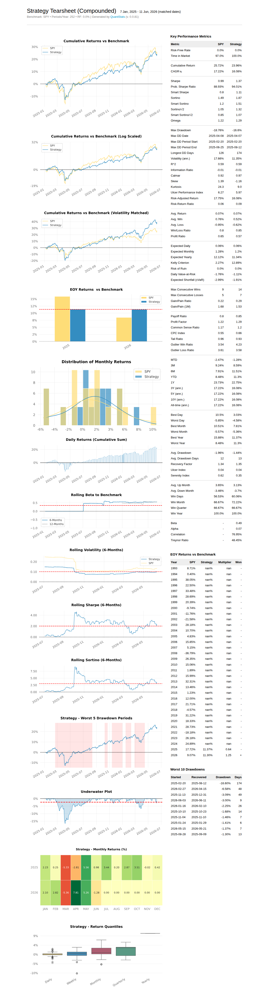

# Portfolio

A small Python library to download and process time series (fund prices) from Morningstar and macroeconomic data from FRED, compute portfolio returns, and generate performance reports.

## Project structure

```
portfolio/
├── run.py                          # Main entry point
├── pyproject.toml
├── uv.lock
├── docs/
│   └── portfolio_performance.png   # Screenshot of the QuantStats report output
├── data/
│   └── portfolio.db                # SQLite storage (created at runtime)
├── html/                           # Web UI (HTML/CSS/JS served by FastAPI)
│   ├── index.html
│   ├── app.js
│   └── style.css
├── src/portfolio/
│   ├── __init__.py                 # Package exports and process_macro_data()
│   ├── analysis.py                 # QuantStats HTML performance reports
│   ├── api/                        # FastAPI web app package
│   │   ├── app.py                  # Routes and application factory
│   │   ├── auth.py                 # JWT authentication
│   │   ├── database.py             # SQLModel storage and queries
│   │   └── models.py               # User, Fund, Portfolio tables
│   ├── download.py                 # Morningstar price downloads
│   ├── funds.py                    # ISIN lookup via Morningstar (Playwright)
│   ├── returns.py                  # Buy-and-hold portfolio return calculation
│   ├── series.py                   # FRED series download
│   └── signals.py                  # Macro and market signal calculations
└── tests/
    ├── test_api.py
    ├── test_funds.py
    ├── test_portfolio.py
    └── test_portfolio_model.py
```

## `run.py`

`run.py` is the main script. It wires together macro analysis, fund price downloads, portfolio return calculation, and report generation.

**Configuration** (inside `if __name__ == "__main__"`):

- `fred_series` — FRED series to download, as `(series_id, column_name)` tuples
- `portfolio` — dict of `{ISIN: weight}`; weights must sum to 1.0
- `start_date` — start of the analysis window (e.g. `"2025-01-01"`)
- `end_date` — end of the window; defaults to today's date

**What `run()` does:**

1. **Macro signals** — Downloads FRED data, computes macro and market signals, and prints the latest values via `print_signals()`.
2. **Portfolio NAVs** — For each ISIN in `portfolio`, resolves the Morningstar fund ID (from the SQLite database when cached), downloads daily prices in EUR, and builds a DataFrame of NAVs indexed by date.
3. **Returns** — Computes buy-and-hold portfolio evolution (no rebalancing) with `calculate_buy_and_hold_returns()`.
4. **Report** — Generates an HTML performance report (`portfolio_performance.html`) benchmarked against SPY using QuantStats.

**Environment**

Create a `.env` file in the project root with your FRED API key:

```
FRED_API_KEY=your_key_here
```

**Run the data job** (macro signals + download fund NAV CSVs for all funds in the database):

```bash
uv run job.py
```

Fund NAV files are written to `data/funds/{ISIN}.csv`. Add funds first via `POST /api/funds` before running the job.

Equivalent wrapper script: `uv run get-data.py`

## API and web UI

Fund ISINs are stored in `data/portfolio.db` (SQLite).

**Start the API server:**

```bash
uv run api
```

Equivalent wrapper script: `uv run api.py`

Open http://localhost:8000 to register, log in, manage funds, save your portfolio, and generate QuantStats HTML reports.

Authentication uses the standard **OAuth2 password flow with JWT bearer tokens**. Set `JWT_SECRET_KEY` in `.env` for production.

### API endpoints

| Method | Path | Auth | Description |
|--------|------|------|-------------|
| `POST` | `/api/auth/register` | — | Create an account (`email`, `password`) |
| `POST` | `/api/auth/token` | — | Log in (form: `username`, `password`) → JWT |
| `GET` | `/api/auth/me` | ✓ | Current user |
| `GET` | `/api/funds` | ✓ | List stored funds |
| `POST` | `/api/funds` | ✓ | Add a fund by ISIN |
| `DELETE` | `/api/funds/{isin}` | ✓ | Remove a fund |
| `GET` | `/api/portfolio` | ✓ | Current user's saved positions |
| `PUT` | `/api/portfolio` | ✓ | Save portfolio positions |
| `POST` | `/api/report` | ✓ | Generate report from saved portfolio |

**Save portfolio body:**

```json
{
  "positions": [
    {"isin": "IE00BYX5NX33", "weighted_assets": 0.65},
    {"isin": "IE00BYX5M476", "weighted_assets": 0.35}
  ]
}
```

**Report request body** (saves portfolio weights, then generates report):

```json
{
  "positions": [
    {"isin": "IE00BYX5NX33", "weighted_assets": 0.65},
    {"isin": "IE00BYX5M476", "weighted_assets": 0.35}
  ],
  "start_date": "2025-01-01",
  "benchmark": "SPY"
}
```

## Result

Running `run.py` end-to-end produces a QuantStats HTML tearsheet (`portfolio_performance.html`) with cumulative returns, drawdowns, rolling metrics, monthly heatmaps, and a full statistics table benchmarked against SPY.



## Technologies

- Python 3.12+
- pandas — dataframes and date handling
- requests — HTTP client for Morningstar price API
- fredapi — FRED API client (macroeconomic series)
- playwright — browser automation for Morningstar ISIN search
- quantstats — HTML performance reports
- fastapi / uvicorn — REST API and web UI

## Install

Create and activate a virtualenv, then install the project:

```bash
python -m venv .venv
source .venv/bin/activate
pip install -e .
```

Or with `uv`:

```bash
uv sync
```

**Commands** (registered in `pyproject.toml`):

| Command | Description |
|---------|-------------|
| `uv run api.py` | Start the FastAPI web server |
| `uv run job.py` | Download macro signals and fund NAV CSVs |

## Tests

```bash
uv run --extra dev pytest -q
```

